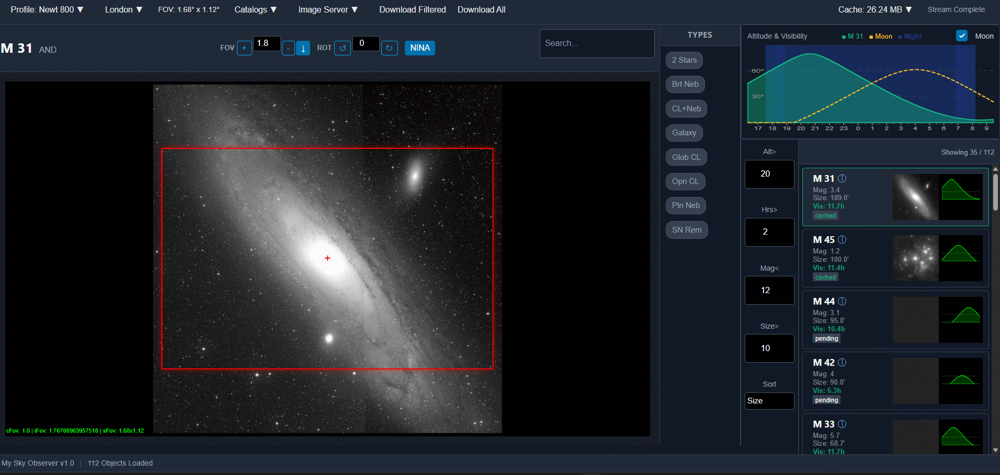

# My Sky Observer

**My Sky Observer** is a comprehensive, web-based tool designed for astrophotographers and visual observers. It simplifies the process of selecting targets, framing them with your specific equipment, and integrating with your capture software.



## ✨ Key Features

*   **Advanced Target Planning**:
    *   Filter objects by **Altitude**, **Visibility Duration** (during astronomical night), and **Object Type** (Galaxies, Nebulae, Clusters, etc.).
    *   Sort targets to find the best objects for your specific night and location.
    *   **Lazy-loaded** object list with altitude graphs and thumbnails.

*   **Interactive Framing**:
    *   Visualize your camera and telescope's **Field of View (FOV)** projected onto Deep Sky Survey (DSS) images.
    *   Adjust rotation and centering to perfect your composition.
    *   **Cache Busting**: Ensures you always see the latest image updates.

*   **Seamless Integration**:
    *   **N.I.N.A. Support**: Send target coordinates and rotation directly to N.I.N.A. via its local API for automated slewing and centering.

*   **Offline Capability**:
    *   Automatically caches downloaded survey images for offline use in the field.
    *   Persistent settings for location and equipment.

*   **User-Friendly Interface**:
    *   Clean, responsive UI built with **Vue 3** and **PicoCSS**.
    *   **Dark Mode** optimized for preserving night vision.
    *   Keyboard navigation support for object lists.

## 🚀 Getting Started

### Prerequisites

*   **Python 3.10+**
*   **Node.js & npm** (for building the frontend)

### Quick Install

**Linux / macOS:**
```bash
# Installs dependencies and builds the frontend
./install.sh

# Run the application
uvicorn backend.main:app --reload
```

**Windows:**
```bat
REM Installs dependencies, builds frontend, and starts the app
install.bat
```

### Manual Installation

If you prefer to install step-by-step:

1.  **Backend Setup**:
    ```bash
    # Create and activate a virtual environment (recommended)
    python -m venv venv
    source venv/bin/activate  # or venv\Scripts\activate on Windows

    # Install Python dependencies
    pip install -r requirements.txt
    ```

2.  **Frontend Setup**:
    ```bash
    cd frontend
    npm install
    npm run build
    cd ..
    ```

## 🖥️ Running the Application

You have two options for running the application:

1.  **Browser / Server Mode (Recommended for most users):**
    ```bash
    uvicorn backend.main:app --reload
    ```
    Access the interface at `http://127.0.0.1:8000`.

2.  **Desktop App Mode:**
    ```bash
    python run.py
    ```
    This launches the application in a standalone window using `pywebview`.

## 🛠️ Configuration

Settings are stored in `settings.json` (created after first run or based on defaults). You can configure:
*   **Location**: Latitude, Longitude, Elevation (or search by City).
*   **Equipment**: Focal length, Camera sensor size.
*   **N.I.N.A.**: Host and Port for integration.

*Note: Most settings can be adjusted directly within the application's UI.*

## 🤝 Contributing

We welcome contributions!

1.  **Development Mode**:
    *   Run the backend: `uvicorn backend.main:app --reload`
    *   Run the frontend (hot-reload): `cd frontend && npm run dev`

2.  **Testing**:
    *   Backend tests are located in `test/`. Run them using `pytest`.
    *   Ensure all tests pass before submitting a pull request.

## 📄 License

This project is licensed under the MIT License - see the [LICENSE](LICENSE) file for details.
