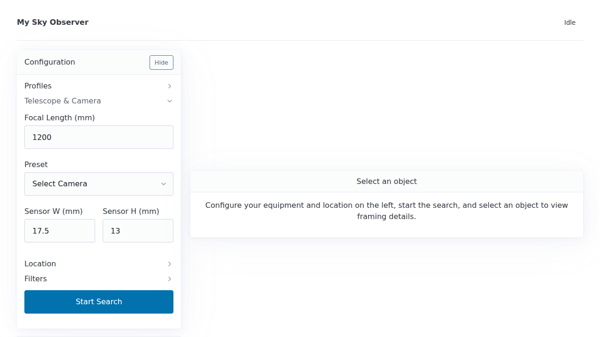

# My Sky Observer

**My Sky Observer** is a comprehensive, web-based tool designed for astrophotographers and visual observers. It simplifies the process of selecting targets, framing them with your specific equipment, and integrating with your capture software.



## ✨ Key Features

*   **Advanced Target Planning**:
    *   Filter objects by **Altitude**, **Visibility Duration** (during astronomical night), **Magnitude**, **Size**, and **Object Type**.
    *   Sort targets to find the best objects for your specific night and location.
    *   **Intelligent Infinite Scroll**: Effortlessly browse through thousands of targets with lazy-loading and smart caching, keeping your browser extremely fast and responsive.
    *   **Cross-Catalog Deduplication**: Seamlessly merges major catalogs (Messier, NGC, IC, etc.) while automatically removing redundant or overlapping entries based on coordinates.

*   **Interactive Framing**:
    *   Visualize your camera and telescope's **Field of View (FOV)** projected onto Deep Sky Survey (DSS) images.
    *   **Zoom & Pan**: Use your mouse wheel to zoom in and out, and drag the FOV box to frame the perfect shot.
    *   **Center & Fetch**: Click "Update/Center Image" to download a fresh high-resolution slice of the sky perfectly centered on your custom framing.
    *   **Cache Busting**: Ensures you always see the latest image updates when tweaking framing settings.

*   **Seamless Integration**:
    *   **N.I.N.A. Support**: Send target coordinates and rotation directly to N.I.N.A. via its local API for automated slewing and centering. (Works natively and via Docker!).

*   **Offline Capability**:
    *   Automatically caches downloaded survey images for offline use in the field.
    *   Persistent settings for location and equipment.

*   **User-Friendly Interface**:
    *   Clean, responsive UI built with **Vue 3** and **PicoCSS**.
    *   **Dark Mode** optimized for preserving night vision.
    *   Keyboard navigation support for object lists.

## 🚀 Getting Started

### 🐳 Running with Docker (Recommended)

The easiest and cleanest way to run **My Sky Observer** is using Docker. This ensures you don't need to install Python, Node.js, or any other system-level dependencies.

```bash
# Build and start the container in the background
docker-compose up -d --build
```

Access the interface at `http://localhost:8000`.

*Note on N.I.N.A. Integration:* The included `docker-compose.yml` automatically sets up the network so the Docker container can talk to N.I.N.A. running on your host Windows machine via `host.docker.internal`.

### 💻 Manual Installation (Local)

**Prerequisites:**
*   **Python 3.10+**
*   **Node.js & npm** (for building the frontend)

**Quick Install (Linux / macOS):**
```bash
# Installs dependencies and builds the frontend
./install.sh

# Run the application
uvicorn backend.main:app --reload
```

**Quick Install (Windows):**
```bat
REM Installs dependencies, builds frontend, and starts the app
install.bat
```

**Step-by-step Local Install:**
1.  **Backend Setup**:
    ```bash
    python -m venv venv
    source venv/bin/activate  # or venv\Scripts\activate on Windows
    pip install -r requirements.txt
    ```
2.  **Frontend Setup**:
    ```bash
    cd frontend
    npm install
    npm run build
    cd ..
    ```

## 🖥️ Running the Application Locally

If you are not using Docker, you have two options for running the application:

1.  **Browser / Server Mode (Recommended):**
    ```bash
    uvicorn backend.main:app --reload
    ```
    Access the interface at `http://127.0.0.1:8000`.

2.  **Desktop App Mode:**
    ```bash
    python run.py
    ```
    This launches the application in a standalone window using `pywebview`.

## 🛠️ Configuration

Settings are automatically stored in `settings_user.yaml`. You can configure:
*   **Location**: Latitude, Longitude, Elevation (or search by City).
*   **Equipment**: Focal length, Camera sensor size, Padding preferences.
*   **Image Servers**: DSS2, SDSS, timeouts, and resolutions.

*Note: All settings should be adjusted directly within the application's UI.*

## 🤝 Contributing

We welcome contributions!

1.  **Development Mode**:
    *   Run the backend: `uvicorn backend.main:app --reload`
    *   Run the frontend (hot-reload): `cd frontend && npm run dev`

2.  **Testing**:
    *   Backend tests are located in `test/`. Run them using `pytest`.
    *   Ensure all tests pass before submitting a pull request.

## 📄 License

This project is licensed under the MIT License - see the [LICENSE](LICENSE) file for details.